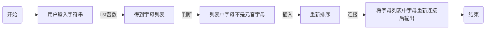

班级：21计科01班


学号：B20210302122


姓名：奉洋


Github地址：https://github.com/ijefie/gittt


CodeWards地址：https://www.codewars.com/users/fyhfyhfyh


### 一、实验过程与结果
1. codewards kata 挑战

挑战一：如果我们列出所有低于 10 的 3 或 5 倍数的自然数，我们得到 3、5、6 和 9。这些数的总和为 23. 完成一个函数，使其返回小于某个整数的所有是3 或 5 的倍数的数的总和。此外，如果数字为负数，则返回 0。

注意：如果一个数同时是3和5的倍数，应该只被算一次。
```python
def solution(number):
    return sum(i for i in range(number) if i%3==0 or i%5==0)
```

挑战二：本练习的目的是将一个字符串转换为一个新的字符串，如果新字符串中的每个字符在原字符串中只出现一次，则为"("，如果该字符在原字符串中出现多次，则为")"。在判断一个字符是否是重复的时候，请忽略大写字母。

例如:

"din"      =>  "((("

"recede"   =>  "()()()"

"Success"  =>  ")())())"

"(( @"     =>  "))(("
```python
def duplicate_encode(word):
    r = []
    word= word.lower()
    for c in word:
        if word.count(c) > 1:
            r.append(')')
        else:
            r.append('(')
    return  ''.join(r)
```

挑战三：写一个函数，接收一串括号，并确定括号的顺序是否有效。如果字符串是有效的，它应该返回True，如果是无效的，它应该返回False。 例如：

"(){}[]" => True 

"([{}])" => True

 "(}" => False

 "[(])" => False 

"[({})](]" => False
```python
def validBraces(string):
    dict_braces = {'}': '{', ']': '[', ')': '('}
    stack = []
    for c in string:
        if c in '({[':
            stack.append(c)
        elif c in ')}]':
            if not stack:
                return False
            if stack[-1] != dict_braces[c]:
                return False
            else:
                stack.pop()
    if not stack:
        return True
    else:
        return False
```

挑战四：有一个不为你所知的秘密字符串。给出一个随机三个字母的组合的集合，恢复原来的字符串。

这里的三个字母的组合被定义为三个字母的序列，每个字母在给定的字符串中出现在下一个字母之前。"whi "是字符串 "whatisup "的一个三个字母的组合。

作为一种简化，你可以假设没有一个字母在秘密字符串中出现超过一次。

对于给你的三个字母的组合，除了它们是有效的三个字母的组合以及它们包含足够的信息来推导出原始字符串之外，你可以不做任何假设。特别是，这意味着秘密字符串永远不会包含不出现在给你的三个字母的组合中的字母。

测试用例：
```python
secret = "whatisup"
triplets = [
  ['t','u','p'],
  ['w','h','i'],
  ['t','s','u'],
  ['a','t','s'],
  ['h','a','p'],
  ['t','i','s'],
  ['w','h','s']
]
test.assert_equals(recoverSecret(triplets), secret)
```
```python
def recoverSecret(triplets):
    r = list({i for t in triplets for i in t})
    for t in triplets:
        fix(r, t[1], t[2])
        fix(r, t[0], t[1])
    return ''.join(r)
      
def fix(t, a, b):
        if t.index(a) > t.index(b):
            t.remove(a)
            t.insert(t.index(b), a)
```

挑战五：喷子正在攻击你的评论区! 处理这种情况的一个常见方法是删除喷子评论中的所有元音(字母：a,e,i,o,u)，以消除威胁。 你的任务是写一个函数，接收一个字符串并返回一个去除所有元音的新字符串。 例如，字符串 "This website is for losers LOL!" 将变成 "Ths wbst s fr lsrs LL!".
```python
def disemvowel(string_):
    out=[]
    mystring=list(string_)
    for i in mystring:
        if i not in ["a","e","i","o","u","A","E","I","O","U"]:
            out.append(i)
    return ''.join(out)


```


2. 使用Mermaid绘制程序流程图



### 二、实验考察
1. Python中的列表可以进行哪些操作？

    主要有 创建、访问、更新和删除。
2. 哪两种方法可以用来对Python的列表排序？这两种方法有和区别？

    方法1.用List的内建函数list.sort进行排序

    方法2.用序列类型函数sorted(list)进行排序

    区别：sorted(list)返回一个对象，可以用作表达式。原来的list不变，生成一个新的排好序的list对象。list.sort() 不会返回对象，改变原有的list。

3. 如何将Python列表逆序打印？
   
   可以适用循环法、切片法或者内建函数
4. Python中的列表执行哪些操作时效率比较高？哪些操作效率比较差？是否有类似的数据结构可以用来替代列表？

    在Python中，对列表进行索引和切片操作的效率比较高，因为列表是基于数组实现的，可以通过索引直接访问元素。而对列表进行插入和删除操作的效率比较差，因为需要移动其他元素来保持列表的连续性。

    可以使用collections.deque类来替代列表。deque是双端队列，支持高效的插入和删除操作，可以在列表的两端进行操作，而不需要移动其他元素。
5. 阅读《Fluent Python》Chapter 2. An Array of Sequence - Tuples Are Not Just Immutable Lists小节（p30-p35）。总结该小节的主要内容。

   列表和元组是Python中最常用的序列类型，列表是可变的，元组是不可变的。
   元组可以作为字典的键，而列表不能。
   列表和元组都可以通过索引和切片进行访问，但元组不支持修改操作。
   元组可以用于交换变量的值，可以用于函数参数的解构赋值。
   元组可以用于命名元组，提高代码的可读性。

### 三、实验总结
此次实验学习了python的列表操作和if语句相关的知识。通过codewards的题目的挑战，我对所学习的列表操作也有了更深的理解，对自己python编程能力也有很大程度上的提升。

