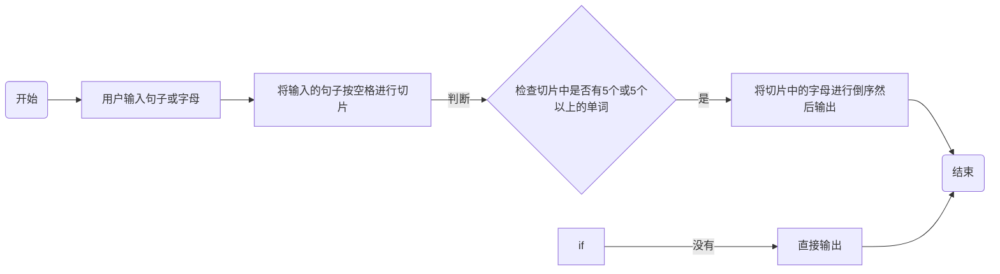
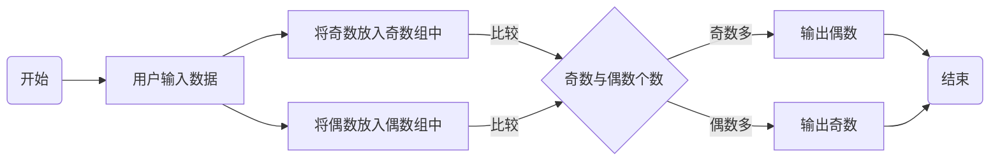
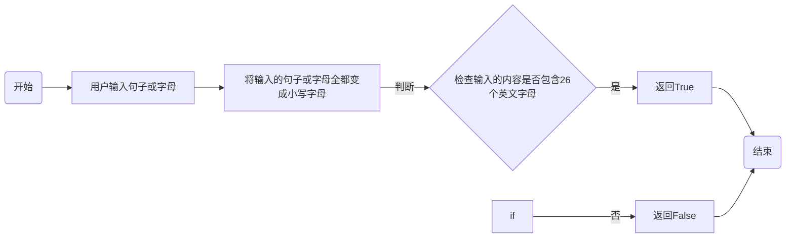

班级：21计科01班

学号：B20210302122

姓名：奉洋

Github地址：https://github.com/ijefie/gittt

CodeWards地址：https://www.codewars.com/users/fyhfyhfyh

### 一、实验过程与结果

1. codewars kata挑战

挑战一：

编写一个函数，接收一个或多个单词的字符串，并返回相同的字符串，但所有5个或更多的字母单词都是相反的（就像这个Kata的名字一样）。传入的字符串将只由字母和空格组成。只有当出现一个以上的单词时，才会包括空格。 例如：

```python
spinWords( "Hey fellow warriors" ) => returns "Hey wollef sroirraw" 
spinWords( "This is a test") => returns "This is a test" 
spinWords( "This is another test" )=> returns "This is rehtona test"
```

代码提交地址： https://www.codewars.com/kata/5264d2b162488dc400000001

```python
def spin_words(sentence):
    sentence = sentence.split(" ")
    return  " ".join([s[::-1] if len(s) >= 5 else s for s in sentence])
```

挑战二：
给你一个包含整数的数组（其长度至少为3，但可能非常大）。该数组要么完全由奇数组成，要么完全由偶数组成，除了一个整数N。请写一个方法，以该数组为参数，返回这个 "离群 "的N。

例如：

```python
[2, 4, 0, 100, 4, 11, 2602, 36]
# Should return: 11 (the only odd number)

[160, 3, 1719, 19, 11, 13, -21]
# Should return: 160 (the only even number)
```

代码提交地址： https://www.codewars.com/kata/5526fc09a1bbd946250002dc

```python
def find_outlier(int):   
  odds = [x for x in int if x%2!=0]   
  evens= [x for x in int if x%2==0]   
  return odds[0] if len(odds)<len(evens) else evens[0]
```

挑战三：
pangram是一个至少包含每个字母一次的句子。例如，"The quick brown fox jumps over the lazy dog "这个句子就是一个pangram，因为它至少使用了一次字母A-Z（大小写不相关）。

给定一个字符串，检测它是否是一个pangram。如果是则返回True，如果不是则返回False。忽略数字和标点符号。 代码提交地址： https://www.codewars.com/kata/545cedaa9943f7fe7b000048

```python
def is_pangram(s):
    s = s.lower()
    for char in 'abcdefghijkfmnopqrstuvwxyz':
        if char not in s:
            return False
    return True
```

挑战四：
数独是一种在 9x9 网格上进行的游戏。游戏的目标是用 1 到 9 的数字填充网格的所有单元格，以便每一列、每一行和九个 3x3 子网格（也称为块）中的都包含数字 1 到 9。更多信息请访问：http://en.wikipedia.org/wiki/Sudoku

编写一个函数接受一个代表数独板的二维数组，如果它是一个有效的解决方案则返回 true，否则返回 false。数独板的单元格也可能包含 0，这将代表空单元格。包含一个或多个零的棋盘被认为是无效的解决方案。棋盘总是 9 x 9 格，每个格只包含 0 到 9 之间的整数。

代码提交地址： https://www.codewars.com/kata/63d1bac72de941033dbf87ae

```python
def validate_sudoku(board):
    elements = set(range(1, 10))
    for b in board:
        if set(b) != elements: 
            return False
    for b in zip(*board):   
        if set(b) != elements: 
            return False
    for i in range(3, 10, 3):
        for j in range(3, 10, 3):
            if elements != {(board[q][w]) 
                            for w in range(j-3, j) 
                            for q in range(i-3, i)}:
                return False   
    return True
```

挑战五：
一个彩色的三角形是由一排颜色组成的，每一排都是红色、绿色或蓝色。连续的几行，每一行都比上一行少一种颜色，是通过考虑前一行中的两个相接触的颜色而产生的。如果这些颜色是相同的，那么新的一行就使用相同的颜色。如果它们不同，则在新的一行中使用缺失的颜色。这个过程一直持续到最后一行，只有一种颜色被生成。

例如：

```python
Colour here:            G G        B G        R G        B R
Becomes colour here:     G          R          B          G
```

一个更大的三角形例子：

```python
R R G B R G B B
 R B R G B R B
  G G B R G G
   G R G B G
    B B R R
     B G R
      R B
       G
```

你将得到三角形的第一行字符串，你的工作是返回最后的颜色，这将出现在最下面一行的字符串。在上面的例子中，你将得到 "RRGBRGBB"，你应该返回 "G"。 限制条件： 1 <= length(row) <= 10 ** 5 输入的字符串将只包含大写字母'B'、'G'或'R'。

例如：

```python
triangle('B') == 'B'
triangle('GB') == 'R'
triangle('RRR') == 'R'
triangle('RGBG') == 'B'
triangle('RBRGBRB') == 'G'
triangle('RBRGBRBGGRRRBGBBBGG') == 'G'
```

代码提交地址： https://www.codewars.com/kata/5a331ea7ee1aae8f24000175

```python

```

2. 使用Mermaid绘制程序流程图

第一题



第二题



第三题



### 二、实验考察

1. 集合（set）类型有什么特点？它和列表（list）类型有什么区别？

Set是最简单的一种集合。集合中的对象不按特定的方式排序，并且没有重复对象。Set接口主要实现了两个实现类：

HashSet : HashSet类按照哈希算法来存取集合中的对象，存取速度比较快
TreeSet : TreeSet类实现了SortedSet接口，能够对集合中的对象进行排序。

区别：List按对象进入的顺序保存对象，不做排序或编辑操作。Set对每个对象只接受一次，并使用自己内部的排序方法(通常，你只关心某个元素是否属于Set,而不关心它的顺序--否则应该使用List)。
2. 集合（set）类型主要有那些操作？
集合（set）类型主要的操作包括创建集合，增删改查和去重，而且能计算集合内元素个数和进行集合的运算操作，比如取交集取并集和异或等等。

3. 使用*操作符作用到列表上会产生什么效果？为什么不能使用*操作符作用到嵌套的列表上？使用简单的代码示例说明。

  创建一个具有指定次数的重复元素的新列表

```python
# 输入列表
inputList = [5, 6, 7]
# 使用*操作符2次重复输入列表
print(inputList * 2)
```

输出如下

```python
[5, 6, 7, 5, 6, 7]
```

序列或列表中的项目未被复制，而是被多次引用。例如：

```python
# 输入列表
inputList_1=[4]

# 使用重复操作符将整个inputList_1乘以三次
inputList_2= inputList_1*3
print('未修改的输入列表1：',inputList_1)
print('未修改的输入列表2：',inputList_2)

# 修改列表的第一个元素值为20
inputList_1[0]= 20
# 输出
print('修改后的输入列表1：',inputList_1)
print('修改后的输入列表2：',inputList_2)

```

输出

```python
未修改的输入列表1：[4]
未修改的输入列表2：[4, 4, 4]
修改后的输入列表1：[20]
修改后的输入列表2：[4, 4, 4]

```

进行乘法运算，例如

```python
a = 1 
b = 1 
c = a * b
```

```python
c=1
```

4. 总结列表,集合，字典的解析（comprehension）的使用方法。使用简单的代码示例说明。

列表解析：通过解析表达式从一个可迭代对象生成一个新的列表

```python
l=[chr(i+ord('A')) for i in range(26) if i%2==0 if i%3==0 if i%4==0 ]#结果为：['A', 'M', 'Y']
```

集合解析：把列表解析的[替换为{即可，集合自带去重属性。

```python
numS = set(numL)
numS
# {-2, -1, 0, 1, 2}
num_squareS = {i**2 for i in numS}
# 少了一部分
num_squareS
# {0, 1, 4}
```

字典解析：通过解析表达式从一个可迭代对象生成一个新的字典

```python
d={i:chr(ord('a')+i) for i in [1,1,2,3]}  #结果d的值为：{1: 'b', 2: 'c', 3: 'd'}
d={i:chr(ord('a')+i+index) for index,i in enumerate([1,1,2,3])} #结果d的值为：{1: 'c', 2: 'e', 3: 'g'}
```

### 三、实验总结

1. 此次实验继续学习了python列表的一些操作，主要是通过codewars kata挑战进行了许多实际性操作，锻炼了自己的python编程能力和思维能力，当然还有一些挑战对我而言难度有点大，暂时没能挑战成功。
