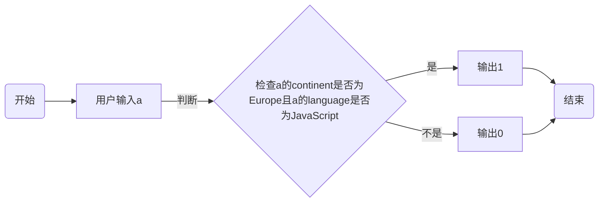

班级：21计科01班

学号：B20210302122

姓名：奉洋

Github地址：https://github.com/ijefie/gittt

CodeWards地址：https://www.codewars.com/users/fyhfyhfyh

### 一、实验过程与结果

1. codewars kata挑战

挑战一：

你将得到一个字典数组，代表关于首次报名参加你所组织的编码聚会的开发者的数据。 你的任务是返回来自欧洲的JavaScript开发者的数量。 例如，给定以下列表：

```python
lst1 = [
  { 'firstName': 'Noah', 'lastName': 'M.', 'country': 'Switzerland', 'continent': 'Europe', 'age': 19, 'language': 'JavaScript' },
  { 'firstName': 'Maia', 'lastName': 'S.', 'country': 'Tahiti', 'continent': 'Oceania', 'age': 28, 'language': 'JavaScript' },
  { 'firstName': 'Shufen', 'lastName': 'L.', 'country': 'Taiwan', 'continent': 'Asia', 'age': 35, 'language': 'HTML' },
  { 'firstName': 'Sumayah', 'lastName': 'M.', 'country': 'Tajikistan', 'continent': 'Asia', 'age': 30, 'language': 'CSS' }
]
```

代码提交地址： https://www.codewars.com/kata/coding-meetup-number-1-higher-order-functions-series-count-the-number-of-javascript-developers-coming-from-europe/train/python

```python
def count_developers(lst):
    def is_ok(a):
        if a['continent']=='Europe' and a['language']=='JavaScript':
            return a
    list1=list(filter(is_ok,lst))
    return len(list1)
```

挑战二：

这次我们想用函数来写计算，并得到结果。让我们看一下一些例子：

例如：

```python
seven(times(five())) # must return 35
four(plus(nine())) # must return 13
eight(minus(three())) # must return 5
six(divided_by(two())) # must return 3
```

要求：

+ 从0（"零"）到9（"九"）的每个数字都必须有一个函数。
+ 必须有一个函数用于以下数学运算：加、减、乘、除。
+ 每个计算都由一个操作和两个数字组成。
+ 最外面的函数代表左边的操作数，最里面的函数代表右边的操作数。
+ 除法应该是整数除法。
例如，下面的计算应该返回2，而不是2.666666...。

```python
eight(divided_by(three()))
```

代码提交地址： https://www.codewars.com/kata/525f3eda17c7cd9f9e000b39

```python
def zero(fun=None):
    return fun(0) if fun else 0
def one(fun=None):
    return fun(1) if fun else 1
def two(fun=None):
    return fun(2) if fun else 2
def three(fun=None):
    return fun(3) if fun else 3
def four(fun=None):
    return fun(4) if fun else 4
def five(fun=None):
    return fun(5) if fun else 5
def six(fun=None):
    return fun(6) if fun else 6
def seven(fun=None):
    return fun(7) if fun else 7
def eight(fun=None):
    return fun(8) if fun else 8
def nine(fun=None):
    return fun(9) if fun else 9

def plus(y):
    return lambda x:x+y
def minus(y):
    return lambda x:x-y
def times(y):
    return lambda x:x*y
def divided_by(y):
    return lambda x:x//y
```

挑战三：

在这个kata中，我们将创建一个函数，它返回另一个缩短长数字的函数。给定一个初始值数组替换给定基数的 X 次方。如果返回函数的输入不是数字字符串，则应将输入本身作为字符串返回。

```python
filter1 = shorten_number(['','k','m'],1000)
filter1('234324') == '234k'
filter1('98234324') == '98m'
filter1([1,2,3]) == '[1,2,3]'
filter2 = shorten_number(['B','KB','MB','GB'],1024)
filter2('32') == '32B'
filter2('2100') == '2KB';
filter2('pippi') == 'pippi'
```

代码提交地址： https://www.codewars.com/kata/56b4af8ac6167012ec00006f

```python
def shorten_number(suffixes, base):
    def my_filter(data):
        try:
            number = int(data)
        except (TypeError, ValueError):
            return str(data)
        else:
            i = 0
            while number//base > 0 and i < len(suffixes)-1:
                number //= base
                i += 1
            return str(number) + suffixes[i]     
    return my_filter  
```

挑战四：

您将获得一个对象序列，表示已注册参加您组织的下一个编程聚会的开发人员的数据。

您的任务是返回一个序列，其中包括最年长的开发人员。如果有多个开发人员年龄相同，则将他们按照在原始输入数组中出现的顺序列出。

例如，给定以下输入数组：

```python
list1 = [
  { 'firstName': 'Gabriel', 'lastName': 'X.', 'country': 'Monaco', 'continent': 'Europe', 'age': 49, 'language': 'PHP' },
  { 'firstName': 'Odval', 'lastName': 'F.', 'country': 'Mongolia', 'continent': 'Asia', 'age': 38, 'language': 'Python' },
  { 'firstName': 'Emilija', 'lastName': 'S.', 'country': 'Lithuania', 'continent': 'Europe', 'age': 19, 'language': 'Python' },
  { 'firstName': 'Sou', 'lastName': 'B.', 'country': 'Japan', 'continent': 'Asia', 'age': 49, 'language': 'PHP' },
]
```

您的程序应该返回如下结果：

```python
[
  { 'firstName': 'Gabriel', 'lastName': 'X.', 'country': 'Monaco', 'continent': 'Europe', 'age': 49, 'language': 'PHP' },
  { 'firstName': 'Sou', 'lastName': 'B.', 'country': 'Japan', 'continent': 'Asia', 'age': 49, 'language': 'PHP' },
]
```

注意：

+ 输入的列表永远都包含像示例中一样有效的正确格式的数据，而且永远不会为空。

代码提交地址： https://www.codewars.com/kata/582887f7d04efdaae3000090

```python
def find_senior(lst): 
    mage = max(a['age'] for a in lst)
    return [a for a in lst if a['age']==mage]
    pass
```

挑战五：
[Currying versus partial application](https://2ality.com/2011/09/currying-vs-part-eval.html)是将一个函数转换为具有更小arity(参数更少)的另一个函数的两种方法。虽然它们经常被混淆，但它们的工作方式是不同的。目标是学会区分它们。

Currying

是一种将接受多个参数的函数转换为以每个参数都只接受一个参数的一系列函数链的技术。

Currying接受一个函数：

```python
f：X × Y → R
```

并将其转换为一个函数：

```python
f'：X → (Y → R)
```

我们不再使用两个参数调用f，而是使用第一个参数调用f'。结果是一个函数，然后我们使用第二个参数调用该函数来产生结果。因此，如果非curried f被调用为：

```python
f(3, 5)
```

那么curried f'被调用为：

```python
f'(3)(5)
```

示例
给定以下函数：

```python
def add(x, y, z):
  return x + y + z
```

我们可以以普通方式调用：

```python
add(1, 2, 3) # => 6
```

但我们可以创建一个curried版本的add(a, b, c)函数：

```python
curriedAdd = lambda a: (lambda b: (lambda c: add(a,b,c)))
curriedAdd(1)(2)(3) # => 6
```

Partial application
是将一定数量的参数固定到函数中，从而产生另一个更小arity(参数更少)的函数的过程。

部分应用接受一个函数：

```python
f：X × Y → R
```

和一个固定值x作为第一个参数，以产生一个新的函数

```python
f'：Y → R
```

f'与f执行的操作相同，但只需要填写第二个参数，这就是其arity比f的arity少一个的原因。可以说第一个参数绑定到x。

示例:

```python
partialAdd = lambda a: (lambda *args: add(a,*args))
partialAdd(1)(2, 3) # => 6
```

你的任务是实现一个名为curryPartial()的通用函数，可以进行currying或部分应用。

例如：

```python
curriedAdd = curryPartial(add)
curriedAdd(1)(2)(3) # => 6

partialAdd = curryPartial(add, 1)
partialAdd(2, 3) # => 6
```

我们希望函数保持灵活性。

所有下面这些例子都应该产生相同的结果：

```python
curryPartial(add)(1)(2)(3) # =>6 
curryPartial(add, 1)(2)(3) # =>6 
curryPartial(add, 1)(2, 3) # =>6 
curryPartial(add, 1, 2)(3) # =>6 
curryPartial(add, 1, 2, 3) # =>6 
curryPartial(add)(1, 2, 3) # =>6 
curryPartial(add)(1, 2)(3) # =>6 
curryPartial(add)()(1, 2, 3) # =>6 
curryPartial(add)()(1)()()(2)(3) # =>6 

curryPartial(add)()(1)()()(2)(3, 4, 5, 6) # =>6 
curryPartial(add, 1)(2, 3, 4, 5) # =>6 

curryPartial(curryPartial(curryPartial(add, 1), 2), 3) # =>6
curryPartial(curryPartial(add, 1, 2), 3) # =>6
curryPartial(curryPartial(add, 1), 2, 3) # =>6
curryPartial(curryPartial(add, 1), 2)(3) # =>6
curryPartial(curryPartial(add, 1)(2), 3) # =>6
curryPartial(curryPartial(curryPartial(add, 1)), 2, 3) # =>6
```

代码提交地址：https://www.codewars.com/kata/53cf7e37e9876c35a60002c9

```python

```

1. 使用Mermaid绘制程序流程图

第一题



### 二、实验考察

1. 什么是函数式编程范式？

    函数式编程（Funtional Programming，简称FP）是一种编程范式，也就是如何编写程序的方法论

主要思想：把计算过程尽量分解成一系列可复用函数的调用

主要特征：函数是“第一等公民”：

函数与其他数据类型一样的地位，可以赋值给其他变量，也可以作为函数参数、函数返回值函数式编程最早出现在LISP语言，绝大大部分的代码编程语言也对函数式编程做了不同程度的支持，比如：Haskell、JavaScript、Python、Swift、Kotlin、Scala等.

2. 什么是lambda函数？请举例说明。

Python 使用 lambda 来创建匿名函数。lambda 函数是一种小型、匿名的、内联函数，它可以具有任意数量的参数，但只能有一个表达式。匿名函数不需要使用 def 关键字定义完整函数。

lambda 函数通常用于编写简单的、单行的函数，通常在需要函数作为参数传递的情况下使用，例如在 map()、filter()、reduce() 等函数中。

```python
f = lambda: "Hello, world!"
print(f())  # 输出: Hello, world!
```

3. 什么是高阶函数？常用的高阶函数有哪些？这些高阶函数如何工作？使用简单的代码示例说明。
  如果一个函数符合下面2个 规范中任何一个，那该函数就是高阶函数
    + 若a函数，接收的参数是一个函数，那么a就可以称之为高阶函数
    + 若a函数，调用的返回值依然是一个函数，那么a就可以称之为高阶函数。
  
```python
#map：一般用于操作数组集合，遍历操作用
    function f(x){
        return x*x
    }
    let arr=[1,2,3,4,5];
    let newArr=arr.map(f);
    console.log(newArr);#[1, 4, 9, 16, 25]
```

```python
#reduce：数组元素计算。
#如：这是数组求和，将元素全部加起来，相当于1+2+3+4+5。
let arr=[1,2,3,4,5];
let num=arr.reduce(function(x,y){
    return x+y
})
console.log(num);#15
```

```python
#筛选掉空字符串、null、undefined：
#trim()是去掉首尾的空格 
let arr=[1,0,'2','',0,'3',null,undefined,'']
let r=arr.filter(function(s){
    if(s!=null&&s!=undefined){
        if((typeof s=="string"&&s.trim()!='')||(typeof s=='number')){
            return true;
        }else{
            return false;
        }
    }
})
console.log(r);
```

### 三、实验总结

1. 此次实验继续学习了python函数的一些操作，主要是通过codewars kata挑战进行了许多实际性操作，锻炼了自己的python编程能力和思维能力，当然还有一些挑战对我而言难度有点大，暂时没能挑战成功。