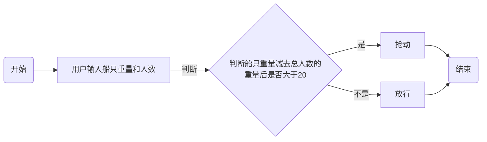

班级：21计科01班

学号：B20210302122

姓名：奉洋

Github地址：https://github.com/ijefie/gittt

CodeWards地址：https://www.codewars.com/users/fyhfyhfyh

### 一、实验过程与结果

1. codewars kata挑战

挑战一：

啊哈，伙计!

你是一个小海盗团的首领。而且你有一个计划。在OOP的帮助下，你希望建立一个相当有效的系统来识别船上有大量战利品的船只。
对你来说，不幸的是，现在的人很重，那么你怎么知道一艘船上装的是黄金而不是人呢？

你首先要写一个通用的船舶类。

```python
class Ship:
    def __init__(self, draft, crew):
        self.draft = draft
        self.crew = crew
```

每当你的间谍看到一艘新船进入码头，他们将根据观察结果创建一个新的船舶对象。

- `draft`吃水 - 根据船在水中的高度来估计它的重量
- `crew`船员 - 船上船员的数量

`Titanic = Ship(15, 10)`

任务

你可以访问船舶的 "draft(吃水) "和 "crew(船员)"。"draft(吃水) "是船的总重量，"船员 "是船上的人数。
每个船员都会给船的吃水增加1.5个单位。如果除去船员的重量后，吃水仍然超过20，那么这艘船就值得掠夺。任何有这么重的船一定有很多战利品!
添加方法
`is_worth_it`
来决定这艘船是否值得掠夺。

例如：

```python
Titanic.is_worth_it()
False
```

祝你好运，愿你能找到金子!

代码提交地址：
<https://www.codewars.com/kata/54fe05c4762e2e3047000add>

```python
class Ship:
    def __init__(self, draft, crew):
        self.draft = draft
        self.crew = crew
    def is_worth_it(self):
        return self.draft - self.crew * 1.5 > 20
```

挑战二：

写一个创建Block的类（Duh.）
构造函数应该接受一个数组作为参数，这个数组将包含3个整数，其形式为`[width, length, height]`，Block应该由这些整数创建。

定义这些方法:

- `get_width()` return the width of the `Block`
- `get_length()` return the length of the `Block`
- `get_height()` return the height of the `Block`
- `get_volume()` return the volume of the `Block`
- `get_surface_area()` return the surface area of the `Block`

例子：

```python
b = Block([2,4,6]) # create a `Block` object with a width of `2` a length of `4` and a height of `6`
b.get_width() # return 2    
b.get_length() # return 4
b.get_height() # return 6
b.get_volume() # return 48
b.get_surface_area() # return 88
```

注意： 不需要检查错误的参数。

代码提交地址：
<https://www.codewars.com/kata/55b75fcf67e558d3750000a3>

```python
class Block:
    
    def __init__(self, args):
        self.width = args[0]
        self.length = args[1]
        self.height = args[2]
        
    def get_width(self):
        return self.width
    
    def get_length(self):
        return self.length
    
    def get_height(self):
        return self.height
    
    def get_volume(self):
        return self.width * self.length * self.height
    
    def get_surface_area(self):
        return 2 * (self.width * self.length + self.width * self.height + self.length * self.height)
```

挑战三：

在这个练习中，你将加强对分页的掌握。你将完成PaginationHelper类，这是一个实用类，有助于查询与数组有关的分页信息。
该类被设计成接收一个值的数组和一个整数，表示每页允许多少个项目。集合/数组中包含的值的类型并不相关。

下面是一些关于如何使用这个类的例子：

```python
helper = PaginationHelper(['a','b','c','d','e','f'], 4)
helper.page_count() # should == 2
helper.item_count() # should == 6
helper.page_item_count(0)  # should == 4
helper.page_item_count(1) # last page - should == 2
helper.page_item_count(2) # should == -1 since the page is invalid

# page_index takes an item index and returns the page that it belongs on
helper.page_index(5) # should == 1 (zero based index)
helper.page_index(2) # should == 0
helper.page_index(20) # should == -1
helper.page_index(-10) # should == -1 because negative indexes are invalid
```

代码提交地址：
<https://www.codewars.com/kata/515bb423de843ea99400000a>

```python
import math
class PaginationHelper:
    def __init__(self, collection, items_per_page):
        self.collection = collection
        self.items_per_page = items_per_page
    def item_count(self):
        return len(self.collection)
    def page_count(self):
        return math.ceil(self.item_count() / self.items_per_page)
    def page_item_count(self, page_index):
        if page_index < 0 or page_index >= self.page_count():
            return -1
        elif page_index == self.page_count() - 1: 
            last_page = self.item_count() % self.items_per_page
            return self.items_per_page if last_page == 0 else last_page
        else:
            return self.items_per_page
    def page_index(self, item_index):
        if item_index < 0 or item_index >= self.item_count():
            return -1
        else:
            return item_index // self.items_per_page
```

挑战四：

创建一个支持加法、减法、点积和向量长度的向量（Vector）类。

举例来说：

```python
a = Vector([1, 2, 3])
b = Vector([3, 4, 5])
c = Vector([5, 6, 7, 8])

a.add(b)      # should return a new Vector([4, 6, 8])
a.subtract(b) # should return a new Vector([-2, -2, -2])
a.dot(b)      # should return 1*3 + 2*4 + 3*5 = 26
a.norm()      # should return sqrt(1^2 + 2^2 + 3^2) = sqrt(14)
a.add(c)      # raises an exception
```

如果你试图对两个不同长度的向量进行加减或点缀，你必须抛出一个错误。
向量类还应该提供：

- 一个 `__str__` 方法，这样 `str(a) === '(1,2,3)'` 
- 一个equals方法，用来检查两个具有相同成分的向量是否相等。

注意：测试案例将利用用户提供的equals方法。

代码提交地址：
<https://www.codewars.com/kata/526dad7f8c0eb5c4640000a4>

```python
from math import sqrt
class Vector:
    def __init__(self, iterable):
        self._v = tuple(x for x in iterable)
    def __str__(self):
        return str(self._v).replace(' ', '')  
    def check(self, other):
        if not len(self._v) == len(other._v):
            raise ValueError('Vectors of different length')
    def add(self, other):
        self.check(other)
        return Vector(s + o for s, o in zip(self._v, other._v))
    def subtract(self, other):
        self.check(other)
        return Vector(s - o for s, o in zip(self._v, other._v))
    def dot(self, other):
        self.check(other)
        return sum(s * o for s, o in zip(self._v, other._v))
    def norm(self):
        return sqrt(sum(x**2 for x in self._v))
    def equals(self, other):
        return self._v == other._v
```

挑战五：
编写一个名为User的类，用于计算用户在类似于Codewars使用的排名系统中的进步量。

业务规则：

- 一个用户从等级-8开始，可以一直进步到8。
- 没有0（零）等级。在-1之后的下一个等级是1。
- 用户将完成活动。这些活动也有等级。
- 每当用户完成一个有等级的活动，用户的等级进度就会根据活动的等级进行更新。
- 完成活动获得的进度是相对于用户当前的等级与活动的等级而言的。
- 用户的等级进度从零开始，每当进度达到100时，用户的等级就会升级到下一个等级。
- 在上一等级时获得的任何剩余进度都将被应用于下一等级的进度（我们不会丢弃任何进度）。例外的情况是，如果没有其他等级的进展（一旦你达到8级，就没有更多的进展了）。
- 一个用户不能超过8级。
- 唯一可接受的等级值范围是-8,-7,-6,-5,-4,-3,-2,-1,1,2,3,4,5,6,7,8。任何其他的值都应该引起错误。

逻辑案例：

- 如果一个排名为-8的用户完成了一个排名为-7的活动，他们将获得10的进度。
- 如果一个排名为-8的用户完成了排名为-6的活动，他们将获得40的进展。
- 如果一个排名为-8的用户完成了排名为-5的活动，他们将获得90的进展。
- 如果一个排名-8的用户完成了排名-4的活动，他们将获得160个进度，从而使该用户升级到排名-7，并获得60个进度以获得下一个排名。
- 如果一个等级为-1的用户完成了一个等级为1的活动，他们将获得10个进度（记住，零等级会被忽略）。

代码案例：

```python
user = User()
user.rank # => -8
user.progress # => 0
user.inc_progress(-7)
user.progress # => 10
user.inc_progress(-5) # will add 90 progress
user.progress # => 0 # progress is now zero
user.rank # => -7 # rank was upgraded to -7
```

代码提交地址：
<https://www.codewars.com/kata/51fda2d95d6efda45e00004e>

```python

```

1. 使用Mermaid绘制程序流程图

第一题



### 二、实验考察

1. Python的类中__init__方法起什么作用？

在Python中，类中的`__init__`方法用于初始化对象的属性。当创建类的实例时，`__init__`方法会被自动调用，并允许我们为对象设置初始状态。在`__init__`方法中，我们可以接收参数并将其分配给对象的属性，以便在创建对象时进行初始化操作。这样可以确保对象在创建后具有所需的初始状态，从而使其能够正常工作。

2. Python语言中如何继承父类和改写（override）父类的方法。

在Python中，要继承父类并改写（override）父类的方法，可以按照以下步骤进行：

创建子类并指定要继承的父类。这可以通过在子类的类定义中将父类作为参数传递来实现。例如：

```python
class ParentClass:
    def some_method(self):
        print("This is the original method in the parent class")

class ChildClass(ParentClass):
    pass
```

在子类中定义一个与父类中要重写的方法同名的方法。这将覆盖父类中的方法。例如：

```python
class ChildClass(ParentClass):
    def some_method(self):
        print("This method overrides the method in the parent class")
```

在这个例子中，`ChildClass`继承了`ParentClass`并重写了`some_method`方法。当调用`some_method`时，将调用`ChildClass`中的方法而不是`ParentClass`中的方法。

这样，通过继承父类并在子类中重写方法，我们可以定制子类的行为，使其符合特定的需求。

3. Python类有那些特殊的方法？它们的作用是什么？请举三个例子并编写简单的代码说明。

Python类有许多特殊的方法，也被称为魔术方法或双下划线方法（dunder methods），它们以双下划线开头和结尾。这些特殊方法允许我们对类的行为进行定制，例如实现自定义的对象比较、迭代、属性访问等。以下是三个常用的特殊方法及其作用：

`__init__`: 初始化方法，用于初始化对象的属性。当创建对象时自动调用该方法。示例代码如下：

```python
class MyClass:
    def __init__(self, value):
        self.value = value

obj = MyClass(10)
print(obj.value)  # 输出: 10
```

`__str__`: 字符串表示方法，用于返回对象的字符串表示。当使用`print`函数打印对象时自动调用该方法。示例代码如下：

```python
class Point:
    def __init__(self, x, y):
        self.x = x
        self.y = y

    def __str__(self):
        return f"Point({self.x}, {self.y})"

p = Point(3, 4)
print(p)  # 输出: Point(3, 4)
```

`__add__`: 加法方法，用于定义对象的加法行为。当使用加号运算符进行操作时自动调用该方法。示例代码如下：

```python
class Vector:
    def __init__(self, x, y):
        self.x = x
        self.y = y

    def __add__(self, other):
        return Vector(self.x + other.x, self.y + other.y)

v1 = Vector(2, 3)
v2 = Vector(4, 5)
result = v1 + v2
print(result.x, result.y)  # 输出: 6 8
```

这些特殊方法允许我们对类的行为进行定制，使得对象可以按照我们期望的方式进行操作和表现。

### 三、实验总结

1. 此次实验继续学习了python的类的一些操作，主要是通过codewars kata挑战进行了许多实际性操作，锻炼了自己的python编程能力和思维能力，当然还有一些挑战对我而言难度有点大，暂时没能挑战成功。
